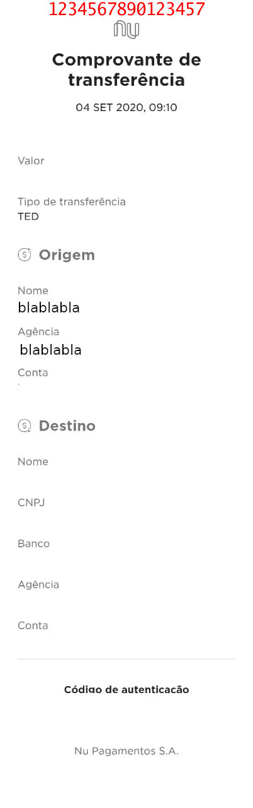

# Write Text Into Image 
## Write identification code of a transfer into a bank transfer

Writes in red color, on the top part of an image, the code(string) provided.

### Usage:
```bash
go run main.go -img=image.jpeg -text=1234567890123457

# optional flag "size", default size is 28
go run main.go -img=image.jpeg -text=1234567890123457 -size=28
```

### Result:  
</img>
